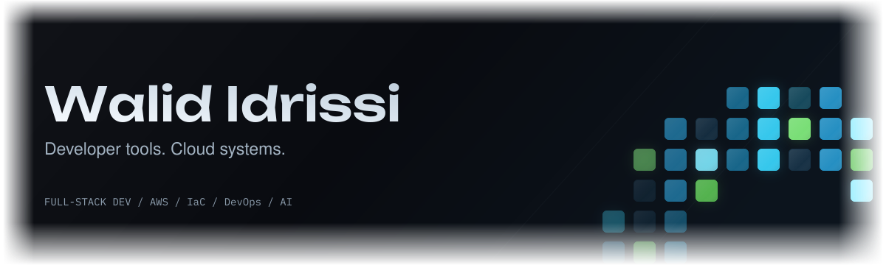

  <picture>
    <source media="(max-width: 600px)" srcset="./assets/header-mobile.svg">
    
  </picture>

I build **Go tools for the terminal** and **web applications backed by cloud infrastructure**.

[Portfolio ↗](https://walid-idrissi.vercel.app/) &nbsp; · &nbsp; [LinkedIn ↗](https://www.linkedin.com/in/walid-idrissi-labkhati/)

## Featured · Canopy

**Parallel coding agents, with results you can verify.**

Run several coding agents from one terminal, with separate Git worktrees when isolation is needed.
Canopy ties verification to the exact code tested and marks results stale when that code changes.

`Go` &nbsp; `Terminal UI` &nbsp; `Git worktrees` &nbsp; **Beta**

[Explore the code →](https://github.com/Walid-Idrissi-Labs/Canopy) &nbsp; · &nbsp; [Releases](https://github.com/Walid-Idrissi-Labs/Canopy/releases) &nbsp; · &nbsp; [Known limitations](https://github.com/Walid-Idrissi-Labs/Canopy/blob/main/LIMITATIONS.md)

## Selected work

**[tascii](https://github.com/Walid-Idrissi-Labs/tascii)** &nbsp; GO / TERMINAL 
A minimal task manager for keeping your work in the terminal.

**[Applyr](https://github.com/Walid-Idrissi-Labs/Applyr)** &nbsp; JAVASCRIPT / WEB APP 
Manage job applications, tasks, and documents. Includes AI resume generation and job imports through a browser extension.

**[SLA-aware monitoring](https://github.com/Walid-Idrissi-Labs/SLA-Aware-Website-Monitoring-System)** &nbsp; TYPESCRIPT / OBSERVABILITY 
Monitor websites and APIs, with SLA reporting built into the workflow.

**[Serverless URL shortener](https://github.com/Walid-Idrissi-Labs/url-shortener)** &nbsp; AWS / TERRAFORM 
Lambda, API Gateway, and DynamoDB behind the links; S3 and CloudFront for delivery. Infrastructure provisioned entirely with Terraform.

---

[More projects and case studies ↗](https://walid-idrissi.vercel.app/)
